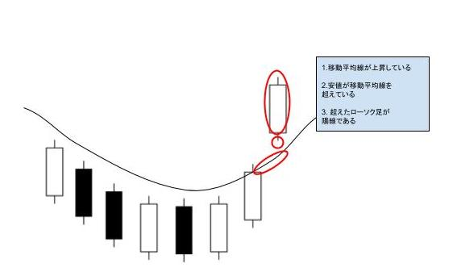

<!-- TOC -->
- [Move Average With Low Value](#move-average-with-low-value)
- [Move Average](#move-average)


<!-- TOC -->

<!-- move average with low value -->

# Move Average With Low Value
## 入力
- pandas dataframe の時系列データ（Open, Close, Highm Low, Volume）

## 出力
- json data
```
{ "result_code_list": [検出した銘柄],
    "method": method name,
    "creat_time": 作成した時間,
    "data_range_start_to_compute": 使用したデータの範囲,
    "data_range_end_to_compute": 使用したデータの範囲,
    "back_test_return_date": バックテストの為に直近のデータから何日分遡ったデータを使ったか
  }
```

## 戦略
### 買い
1. ７５日移動平均線が上向いている
1. ７５日移動平均線の下にあった株価（安値）が上に抜ける
1. 抜けたローソク足が陽線である

### 売り（未実装）
1. ７５日移動平均線を下に抜ける

## 処理内容(select_code function)
1. ヒストリカルデータをClose だけのデータに整形(shape_stock_data)

1. 移動平均を計算する(get_move_average)
1. 2のときに${window}日移動平均を計算する(defalt は75日)
1. 前後１日のデータの差分データを計算（差分データ１）
1. 対象とするデータの範囲を決定する(${sign_rising_MA_term}+1, defalt は最近のデータから21日分, 対象範囲１)
1. 対象範囲１で差分データ１が0より大きい箇所がないかを判断する(diff>0, 判断材料１)
1. 判断材料１に当てはまった場合は対象期間1の初めのMAの値と終わりの値の上昇率を求める(raising_rate_MA)

1. 移動平均とLowの差分を計算(Low - MoveAverage, 差分データ２)
1. 対象とするデータの範囲を決定する(${sign_rising_Low_term}+1, defalt は最近のデータから21日分, 対象範囲２)
1. 対象範囲２で差分データ２が0より大きい箇所がないかを判断する(diff>0)
1. 差分データを使って(n日: MA > Low, n+1日: Low > MA)となる箇所があるかどうか
かつn+1日が陽線であるかどうかを確認する（判断料２）
1. 判断材料１と判断材料２をどちらを満たす銘柄を選択銘柄とする
(raising_rate_MAが大きい順に保持する)

## イメージ


<!-- move average with low value -->

<!-- move average -->

# Move Average


<!-- move average -->
