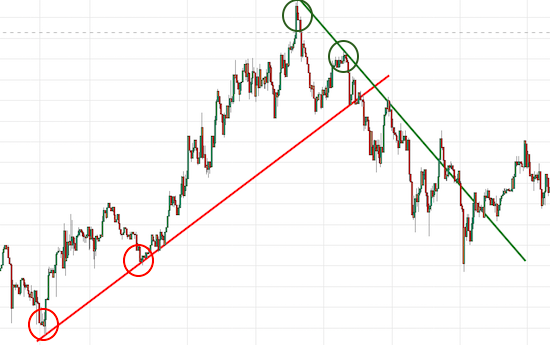

<!-- TOC -->
- Stock Strategy
  - [Move Average](#move-average)
    - [Move Average With Low Value](#move-average-with-low-value)
  - [Trend Line](#trend-line)
    - [Trend Conversion Line](#trend-conversion-line)
  - [Trend Line Using Linear Regression](#trend-line-using-linear-regression)
<!-- TOC -->

<!-- move average with low value -->

# Move Average With Low Value
## 入力
- pandas dataframe の時系列データ（Open, Close, Highm Low, Volume）

## 出力
- json data
```
{ "result_code_list": [検出した銘柄],
    "method": method name,
    "creat_time": 作成した時間,
    "data_range_start_to_compute": 使用したデータの範囲,
    "data_range_end_to_compute": 使用したデータの範囲,
    "back_test_return_date": バックテストの為に直近のデータから何日分遡ったデータを使ったか
  }
```

## 戦略
### 買い
1. ７５日移動平均線が上向いている
1. ７５日移動平均線の下にあった株価（安値）が上に抜ける
1. 抜けたローソク足が陽線である

### 売り（未実装）
1. ７５日移動平均線を下に抜ける

## 処理内容(select_code function)
1. ヒストリカルデータをClose だけのデータに整形(shape_stock_data)

1. 移動平均を計算する(get_move_average)
1. 2のときに${window}日移動平均を計算する(defalt は75日)
1. 前後１日のデータの差分データを計算（差分データ１）
1. 対象とするデータの範囲を決定する(${sign_rising_MA_term}+1, defalt は最近のデータから21日分, 対象範囲１)
1. 対象範囲１で差分データ１が0より大きい箇所がないかを判断する(diff>0, 判断材料１)
1. 判断材料１に当てはまった場合は対象期間1の初めのMAの値と終わりの値の上昇率を求める(raising_rate_MA)

1. 移動平均とLowの差分を計算(Low - MoveAverage, 差分データ２)
1. 対象とするデータの範囲を決定する(${sign_rising_Low_term}+1, defalt は最近のデータから21日分, 対象範囲２)
1. 対象範囲２で差分データ２が0より大きい箇所がないかを判断する(diff>0)
1. 差分データを使って(n日: MA > Low, n+1日: Low > MA)となる箇所があるかどうか
かつn+1日が陽線であるかどうかを確認する（判断料２）
1. 判断材料１と判断材料２をどちらを満たす銘柄を選択銘柄とする
(raising_rate_MAが大きい順に保持する)

## イメージ


<!-- move average with low value -->

<!-- move average -->

# Move Average
## 戦略
### 買い
1. 移動平均線が直近で上昇している銘柄を選択

<!-- move average -->

<!-- trend line -->

# Trend Line
- Algorithm in DS_Q

## 機能
1. peak をもとめる(large peak)
1. 直近との距離が${length_limited_between_end_and_latest}以下であるend peak を無視
1. start peak と end peakを結んだ線（トレンドライン）を作成する
  1. start peak と end peak の距離を計算
  1. トレンドラインの傾きを計算
  1. ラインの集合を作成
  1. ライン上にある peak でないキャンドルを取得
  1. ラインの範囲の高値を取得
  1. 高値とライン上の値を比べる
  1. 以下の内容を満たすラインをトレンドライン候補とし、取得する
    1. 「高値がトレンドラインを上回っていない」
    1. 「ラインの範囲のピーク点とラインの１点の差の絶対値が${value_accept_between_high_value_and_list}を下回る」と「start peak」
    1. 「start peak」と「end peak」の間にpeakが存在する
  1. 以下のどれかの内容を満たすトレンドラインをトレンドラインとし、取得する
    1. 「ルール１」: 「start peak と end peak の間のピークの数が１個もしくは２個」かつ「トレンドラインの長さが${candle_num_start_to_end}以下」
    1. 「ルール１（直近）」：「start peak と end peak の間のピークの数が１個もしくは２個」
    1. 「ルール２」：「start peak と end peak の間のピークの数が３個以上」
1. エンドピークが一番直近にあるトレンドラインを選択（複数ある場合は短いトレンドラインを選択）

<!-- trend line -->

<!-- trend line using linear regression -->

# Trend Line Using Linear Regression
- [参考：PythonでFXのトレンドラインを引いてみる](http://www.algo-fx-blog.com/python-fx-trend-line/)



<!-- trend line using linear regression -->


<!-- trend conversion line -->

# Trend Conversion Line
- Algorithm In 「世界一やさしいの教科書１年生 P.171~」

## 戦略
### 買い
1. チャートの上に存在するトレンドライン（抵抗線）を上につけ抜ける銘柄を選択
1. 上に突き抜ける瞬間に移動平均線が上昇している

<!-- trend conversion line -->
